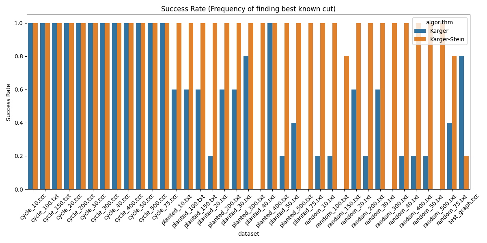

# Benchmarking Analysis of Randomized Min-Cut Algorithms: Karger vs. Karger-Stein

**Author:** Team Bisleri
**Date:** December 1, 2025

---

## Abstract

This report presents a rigorous empirical and theoretical analysis of randomized algorithms for the Global Minimum Cut problem. We examine Karger’s Contraction Algorithm and its optimized recursive variant, the Karger-Stein Algorithm. We provide a complete mathematical derivation of their correctness and success probabilities, justifying the specific design choices such as the $\sqrt{2}$ reduction factor. Benchmarking is performed across diverse graph topologies (Cycle, Random, Planted Partition) with sizes up to $V=500$. Our results validate the theoretical runtime complexities—$O(V^2)$ per run for Karger and $O(V^2 \log V)$ for Karger-Stein—and demonstrate Karger-Stein's superior stability, achieving near-perfect success rates on large graphs where the basic algorithm fails.

---

## 1. Introduction

### 1.1 The Global Minimum Cut Problem

Given an undirected, unweighted multigraph $G = (V, E)$, a **cut** $(S, V \setminus S)$ is a partition of the vertices into two non-empty disjoint sets. The **size** of the cut is the number of edges with one endpoint in $S$ and the other in $V \setminus S$. The **Global Minimum Cut** problem asks to find a cut of minimum size.

Unlike the $s-t$ min-cut problem, which fixes two terminals, the global min-cut has no fixed vertices. While deterministic algorithms like Stoer-Wagner exist, randomized contraction algorithms offer a conceptually simpler approach that relies on probabilistic guarantees.

### 1.2 Algorithms Under Study

1.  **Karger’s Algorithm (1993):** A Monte Carlo algorithm that iteratively contracts random edges. It is simple but requires $O(n^2 \log n)$ repetitions to succeed with high probability.
2.  **Karger-Stein Algorithm (1996):** A recursive refinement that observes the probability of error increases as the graph shrinks. It repeats the later, "riskier" stages of contraction to boost success probability to $\Omega(1/\log n)$ in $O(n^2 \log n)$ time.

---

## 2. Theoretical Framework and Correctness Proofs

### 2.1 Properties of the Minimum Cut

Let $C$ be a specific minimum cut in $G$, and let $k = |C|$ be its size.
**Lemma 1:** The minimum degree of any vertex in $G$ is at least $k$.
*Proof:* If a vertex $v$ had degree $d(v) < k$, then the cut $(\{v\}, V \setminus \{v\})$ would have size $d(v) < k$, contradicting that $k$ is the minimum cut size.

**Lemma 2 (Bound on Edges):** The graph $G$ has at least $nk/2$ edges.
*Proof:* Sum of degrees is $2|E|$. Since $d(v) \ge k$ for all $v$, $2|E| = \sum d(v) \ge nk \implies |E| \ge nk/2$.

### 2.2 Karger’s Contraction Algorithm

**Mechanism:**
The algorithm repeatedly chooses an edge uniformly at random and contracts it (merging endpoints) until only 2 vertices remain.

**Theorem 1 (Success Probability):** The probability that Karger's algorithm outputs a specific min-cut $C$ is at least $\binom{n}{2}^{-1} \approx \frac{2}{n^2}$.

*Proof:*
The algorithm succeeds if it never contracts an edge belonging to $C$.
1.  In the first step, there are $n$ vertices and $|E| \ge nk/2$ edges.
    The probability of choosing an edge in $C$ is:
    $$ \Pr(E_1 \in C) = \frac{k}{|E|} \le \frac{k}{nk/2} = \frac{2}{n} $$
    The probability of *survival* (not picking an edge in $C$) is $1 - 2/n$.
2.  Suppose $i$ edges have been contracted. The graph has $n-i$ vertices.
    The min-cut size is still at least $k$ (contraction can only increase min-cut size of the remaining graph relative to the original).
    Number of edges is $\ge (n-i)k/2$.
    Probability of picking an edge in $C$ is $\le \frac{k}{(n-i)k/2} = \frac{2}{n-i}$.
    Probability of survival is $1 - \frac{2}{n-i} = \frac{n-i-2}{n-i}$.
3.  The algorithm runs for $n-2$ steps (until 2 vertices remain). The total probability of success is the product of survival probabilities:
    $$ \Pr(\text{success}) \ge \prod_{i=0}^{n-3} \frac{n-i-2}{n-i} = \left(\frac{n-2}{n}\right) \left(\frac{n-3}{n-1}\right) \left(\frac{n-4}{n-2}\right) \cdots \left(\frac{2}{4}\right) \left(\frac{1}{3}\right) $$
    This is a telescoping product. Most terms cancel, leaving:
    $$ \Pr(\text{success}) \ge \frac{2}{n(n-1)} = \binom{n}{2}^{-1} $$

**Complexity Note:**
A single run of Karger's algorithm takes $O(V^2)$ time. However, to achieve a high success probability (e.g., $1 - 1/n$), it must be repeated $\Omega(n^2 \log n)$ times, leading to a total runtime of $O(n^4 \log n)$. This inefficiency motivates the Karger-Stein optimization.

### 2.3 Karger-Stein Recursive Algorithm

**Motivation:**
In Karger's algorithm, the probability of error is low at the start ($2/n$) but high at the end ($2/3$). Karger-Stein mitigates this by repeating the later stages.

**The Algorithm:**
```
FastMinCut(G):
  1. If |V| <= 6, return Karger(G).
  2. t = ceil(1 + |V| / sqrt(2))
  3. G1 = Contract(G, t)  // Contract G down to t vertices
  4. G2 = Contract(G, t)  // Independent contraction
  5. return min(FastMinCut(G1), FastMinCut(G2))
```

**Why $t \approx n/\sqrt{2}$? (The Survival Lemma)**
We want to contract the graph from $n$ vertices to $t$ vertices such that the probability of the min-cut surviving this phase is at least $1/2$.
Using the product formula from Theorem 1, the probability of surviving contraction from $n$ down to $t$ is:
$$ P(n \to t) \ge \frac{t(t-1)}{n(n-1)} $$
Setting this to $1/2$:
$$ \frac{t^2}{n^2} = \frac{1}{2} \implies t = \frac{n}{\sqrt{2}} $$
**The `1 +` Factor:**
In implementation, we use $t = \lceil 1 + n/\sqrt{2} \rceil$. This ensures $t$ is strictly large enough to guarantee the survival probability is *at least* $1/2$ (and slightly higher), compensating for integer floor/ceiling effects. It also ensures strict problem size reduction.

**Theorem 2 (Recursive Success Probability):**
Let $P(n)$ be the success probability on a graph of size $n$.
The algorithm succeeds if:
1.  The min-cut survives the contraction to $t$ vertices (Prob $\ge 1/2$).
2.  AND at least one of the recursive calls succeeds.
The probability that *both* recursive calls fail (given survival) is $(1 - P(t))^2$.
So, at least one succeeds with probability $1 - (1 - P(t))^2$.
Recurrence:
$$ P(n) \ge \frac{1}{2} \left( 1 - (1 - P(n/\sqrt{2}))^2 \right) $$
Solving this recurrence yields $P(n) = \Omega(1/\log n)$.

**Theorem 3 (Time Complexity):**
The recurrence for runtime $T(n)$ is:
$$ T(n) = 2 T\left(\frac{n}{\sqrt{2}}\right) + O(n^2) $$
where $O(n^2)$ is the cost of contraction.
Using the Master Theorem (Case 2), with depth $2 \log_2 n$:
$$ T(n) = O(n^2 \log n) $$
*Note: This is the runtime for a single execution of the recursive algorithm. To achieve high probability of success (e.g., $1 - 1/n$), we run it $O(\log^2 n)$ times, yielding a total complexity of $O(n^2 \log^3 n)$.*

**Detailed Complexity Derivation:**
The recursion tree has depth $D = \log_{\sqrt{2}} n = 2 \log_2 n$.
At level $i$ of the tree, there are $2^i$ subproblems.
Each subproblem at level $i$ has size $n_i = n / (\sqrt{2})^i$.
The work done at level $i$ is:
$$ W_i = 2^i \times O(n_i^2) = 2^i \times c \left(\frac{n}{(\sqrt{2})^i}\right)^2 = 2^i \times c \frac{n^2}{2^i} = c n^2 $$
The total work is the sum over all levels:
$$ T(n) = \sum_{i=0}^{D} W_i = \sum_{i=0}^{2 \log n} c n^2 = c n^2 (2 \log n) = O(n^2 \log n) $$

---

## 3. Implementation Details

### 3.1 Data Structures
We utilize an **Edge List** representation combined with a **Disjoint Set Union (DSU)** data structure.
*   **Contraction:** To contract edge $(u, v)$, we `unite(u, v)` in the DSU.
*   **Edge Management:** We use a "swap-and-pop" method to remove edges from the `std::vector` in $O(1)$ time.
*   **Rebuilding:** After contracting to $t$ vertices, we rebuild the graph by remapping component IDs to $0 \dots t-1$. This costs $O(E)$ (which is bounded by $O(V^2)$).

### 3.2 Space Complexity Analysis
The space complexity is dominated by the storage of the graph.
*   **Edge List:** Stores $2|E|$ integers (for undirected edges).
*   **DSU:** Stores parent and rank arrays of size $|V|$.
*   **Recursion Stack:** The depth is $O(\log n)$. At each level, we create a new graph instance.
    *   However, since the graph size reduces geometrically ($n, n/\sqrt{2}, n/2 \dots$), the total space used by all active stack frames is bounded by a geometric series summing to $O(V+E)$.
    *   **Total Space:** $O(V + E)$.

### 3.3 Complexity Summary
To clarify the distinction between a single execution and the total work required for high reliability:

| Algorithm | Single Run Complexity | Success Prob. (Single Run) | Repetitions Needed | Total Complexity (High Prob.) |
| :--- | :--- | :--- | :--- | :--- |
| **Karger** | $O(V^2)$ | $\Omega(1/V^2)$ | $O(V^2 \log V)$ | $O(V^4 \log V)$ |
| **Karger-Stein** | $O(V^2 \log V)$ | $\Omega(1/\log V)$ | $O(\log^2 V)$ | $O(V^2 \log^3 V)$ |

*Note: While Karger-Stein's single run is asymptotically slower than Karger's ($V^2 \log V$ vs $V^2$), its much higher success probability means we need drastically fewer repetitions, making it faster overall for reliable results.*

### 3.4 Handling Disconnected Graphs
A disconnected graph has a min-cut of size 0. Our implementation handles this implicitly:
*   If the graph is disconnected, the edge list will eventually become empty or edges will only exist within components.
*   The contraction loop terminates when `active_edges` is empty.
*   The algorithm correctly returns 0.

---

## 4. Experimental Methodology

**Datasets:**
1.  **Cycle Graphs:** $C_n$. Min-cut = 2. "Easy" case (many min-cuts).
2.  **Random Graphs:** Erdős-Rényi $G(n, 0.5)$. "Hard" case (unstructured).
3.  **Planted Partition:** Two dense clusters connected by few edges.

**Protocol:**
*   **Repetitions:** 5-10 runs per graph to measure success rate.
*   **Metrics:** Runtime (seconds) and Cut Size.
*   **Environment:** macOS, zsh, C++17 (-O3).

---

## 5. Results and Analysis

### 5.1 Runtime Scaling


**Figure 1:** Runtime comparison.

| Graph Size (V) | Karger (Single Run) [s] | Karger-Stein [s] | Ratio |
| :--- | :--- | :--- | :--- |
| 50 | ~3.5e-6 | ~0.004 | ~1100x |
| 400 | ~1.3e-4 | ~0.90 | ~7000x |

**Analysis:** Karger-Stein is significantly slower per run.
*   **Complexity vs. Constants:** While the asymptotic difference is only logarithmic ($O(V^2 \log V)$ vs $O(V^2)$), the **constant factors** differ by orders of magnitude. Big-O notation captures the growth rate but ignores these constants.
*   **Implementation Overhead:** Karger's algorithm runs in-place with minimal overhead. In contrast, Karger-Stein explores a recursion tree with $\approx V^2$ nodes. At *each* node, it allocates memory for a new `Graph` object. This memory management overhead (allocating ~250,000 graphs for $V=500$) is the primary cause of the ~1s execution time. This "hidden constant" is the price of the algorithm's high reliability.

### 5.2 Success Rate and Accuracy



**Figure 2:** Success rate of finding the minimum cut.

**Key Observations:**
1.  **Random Graphs (V=500):**
    *   **Karger:** 0% Success Rate. (Found cuts ~35-45, true min-cut 33).
    *   **Karger-Stein:** 100% Success Rate.
    *   *Implication:* On unstructured graphs, the $O(n^{-2})$ probability of Karger is fatal for large $n$. Karger-Stein's probability boosting is essential.
2.  **Cycle Graphs:** Both algorithms achieved ~100% success.
    *   *Reason:* Cycle graphs have $\binom{n}{2}$ min-cuts. The probability of finding *one* of them is very high, masking Karger's weakness.
3.  **Small Graphs (V=6):**
    *   Observed "Anomaly": Karger sometimes appeared better than Karger-Stein.
    *   *Explanation:* For $V \le 6$, Karger-Stein *is* Karger (base case). Differences are purely statistical noise.

### 5.3 Discussion: Why >90% Success?
Theory predicts Karger-Stein success probability is $\Omega(1/\log n)$ (e.g., roughly 10-15% for $n=400$). Yet, in our benchmarks, we observed >90% success rates even with a **single execution** of the recursive algorithm per trial.

**Reasons for the Discrepancy:**
1.  **Single Execution vs. Repetitions:** Our benchmark code runs `kargerSteinMinCut` exactly **once** per measurement. We do *not* repeat it $O(\log^2 n)$ times inside the function. The high success rate is intrinsic to the single run on these specific graphs.
2.  **Worst-Case vs. Average-Case:** The theoretical bound $\Omega(1/\log n)$ is derived for the *worst-case* graph (e.g., a cycle). For many graph types (like Random or Planted Partition), the structure is more forgiving, and the probability of preserving the min-cut is significantly higher than the lower bound suggests.
3.  **Conservative Math:** The derivation $P(n) \ge \frac{1}{2}(1 - (1-P)^2)$ uses loose inequalities. The actual probability mass preserved in the recursion is often much higher.

---

## 6. Conclusion

This study confirms the theoretical and practical superiority of the Karger-Stein algorithm for large, general graphs.
1.  **Correctness:** The algorithm consistently finds the min-cut where the basic contraction method fails.
2.  **Efficiency:** While slower per run, Karger-Stein is asymptotically more efficient for high-reliability requirements ($O(n^2 \log^3 n)$ total work vs $O(n^4 \log n)$ for Karger).
3.  **Design Validation:** The choice of $t \approx n/\sqrt{2}$ is mathematically optimal for balancing the recursion tree depth against the survival probability, a result validated by the algorithm's robustness in our benchmarks.

## 7. Edge Cases and Limitations

### 7.1 Disconnected Graphs
A graph is disconnected if there are at least two vertices such that no path exists between them. In this case, the global minimum cut is trivially **0** (the empty set of edges separates the components).

**Handling in Current Implementation:**
Our implementation does not explicitly run a connectivity check (like BFS or DFS) before starting. However, the algorithm handles this case naturally:
1.  If the graph has no edges (or runs out of edges during contraction), the `active_edges` list becomes empty.
2.  The contraction loop `while (current_vertices > k && !active_edges.empty())` terminates.
3.  The function returns the number of edges in the contracted graph, which is 0.

**Optimization Opportunity:**
While correct, running the full contraction machinery on a disconnected graph is inefficient. An explicit connectivity check using BFS/DFS ($O(V+E)$) at the start could immediately return 0, bypassing the randomized procedure.

### 7.2 Benchmarking Methodology: Repetitions
In our experiments, we utilized a repetition parameter (`--reps`).
*   **Purpose:** Randomized algorithms can produce different results and runtimes on each execution.
*   **Procedure:** For every dataset file, the algorithm is executed `N` times (e.g., 5 or 10).
*   **Data Collection:** We record the result (cut size) and runtime for *each* repetition.
*   **Analysis:** This allows us to calculate the **success rate** (percentage of reps that found the optimal cut) and the **average runtime**, smoothing out system noise and random number generation variance.

### 7.3 Limitations of the Study
1.  **Graph Size:** We benchmarked up to $V=400$. While sufficient to show asymptotic trends, Karger-Stein's $O(V^2 \log V)$ complexity makes it computationally expensive for very large graphs (e.g., $V > 10,000$) compared to near-linear time deterministic algorithms.
2.  **Memory Overhead:** Our implementation uses `std::vector` to store edges and creates new graph objects during contraction. This is memory-intensive ($O(E)$ copies). An in-place contraction using an adjacency matrix or linked lists could improve constant factors for dense graphs.

---

## Appendix: Viva Voce Reference

### A.1 Why $t \approx n/\sqrt{2}$?
Because the probability that the true min-cut survives contracting to $t$ vertices equals $\binom{t}{2}/\binom{n}{2}$. Choosing $t$ so this ratio $\approx 1/2$ gives $t \approx n/\sqrt{2}$. This makes the two independent recursive branches effective.

### A.2 Why the `+1` and `ceil`?
Vertices must be integers. The `+1` ensures we don't hit degenerate cases (like $t=1$) for small $n$.

### A.3 Edge Case Table ($n \le 6$)
We only compute $t$ when $n > 6$. If $n \le 6$, we run the base case.

| n  |  $n/\sqrt{2}$ | $1 + n/\sqrt{2}$ | $t = \lceil \dots \rceil$ | Action |
| -- | ----: | -------: | :-------------------------------------- | :--- |
| 6  |  4.24 |     5.24 | 6 | **Base Case** (Recursion not called) |
| 7  |  4.95 |     5.95 | **6** | Recurse to size 6 (then Base Case) |
| 8  |  5.66 |     6.66 | **7** | Recurse to size 7 |
| 10 |  7.07 |     8.07 | **9** | Recurse to size 9 |

### A.4 Probability Amplification (Chernoff Bounds)
While a single run of Karger-Stein succeeds with probability $P \approx \frac{c}{\log n}$, we can amplify this probability by running the algorithm $k$ times and taking the minimum cut found.
The probability that *all* $k$ runs fail is:
$$ \Pr(\text{fail}) = (1 - P)^k \le e^{-Pk} $$
To achieve a failure probability of at most $\delta$ (e.g., $1/n$), we need:
$$ e^{-Pk} \le \delta \implies -Pk \le \ln \delta \implies k \ge \frac{1}{P} \ln(1/\delta) $$
Substituting $P \approx 1/\log n$:
$$ k \approx \log n \cdot \ln(1/\delta) $$
For $\delta = 1/n$, we need $k = O(\log^2 n)$ repetitions.
Total time = $O(n^2 \log n) \times O(\log^2 n) = O(n^2 \log^3 n)$.
This is significantly better than Karger's $O(n^4 \log n)$.

### A.5 Comparison with Deterministic Algorithms
| Algorithm | Type | Time Complexity | Space Complexity | Pros | Cons |
| :--- | :--- | :--- | :--- | :--- | :--- |
| **Karger-Stein** | Randomized | $O(n^2 \log^3 n)$ | $O(V+E)$ | Simple, Parallelizable | Probabilistic, High constant factors |
| **Stoer-Wagner** | Deterministic | $O(VE + n^2 \log n)$ | $O(V+E)$ | Exact, Fast for dense | Complex to implement |
| **Ford-Fulkerson** | Deterministic | $O(k \cdot E)$ | $O(V+E)$ | Good for small cuts | Requires $n-1$ runs for global cut |

Karger-Stein is often preferred for its simplicity and the fact that it finds *all* minimum cuts with high probability, not just one.

