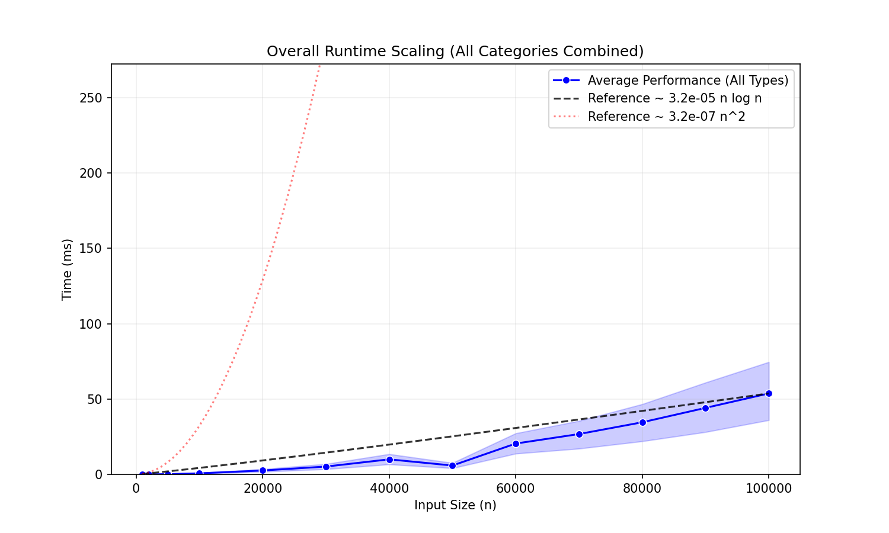
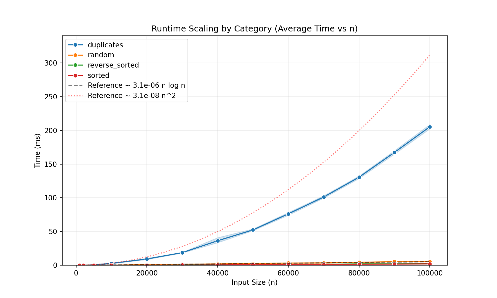
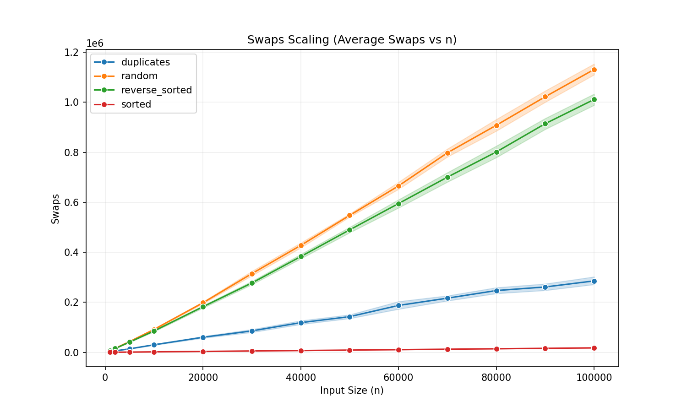
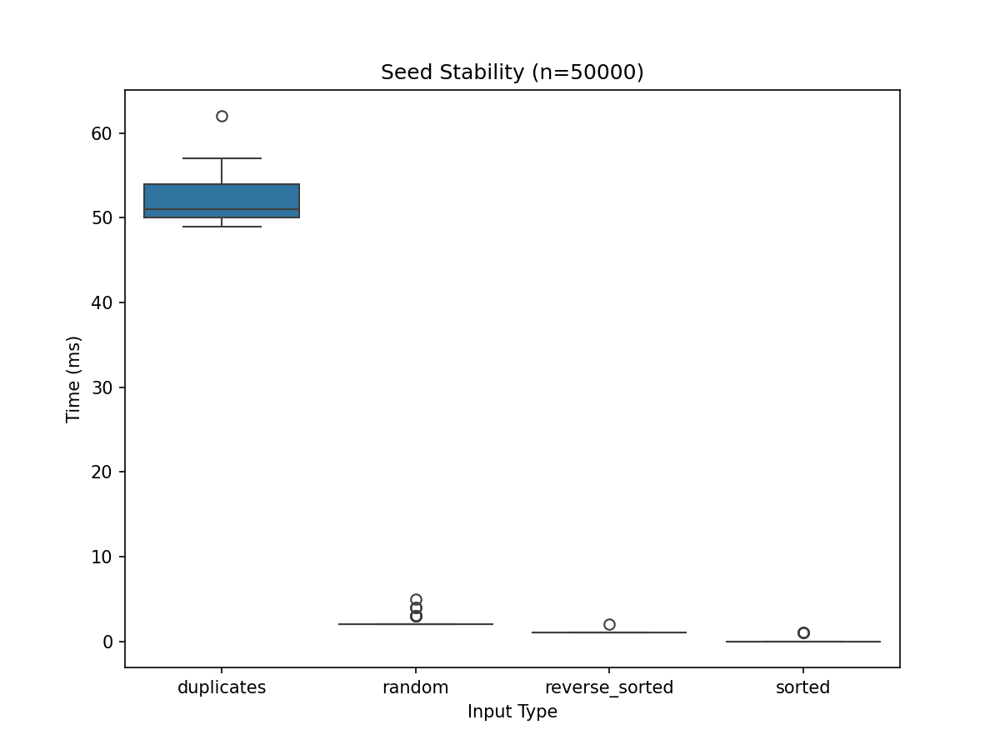
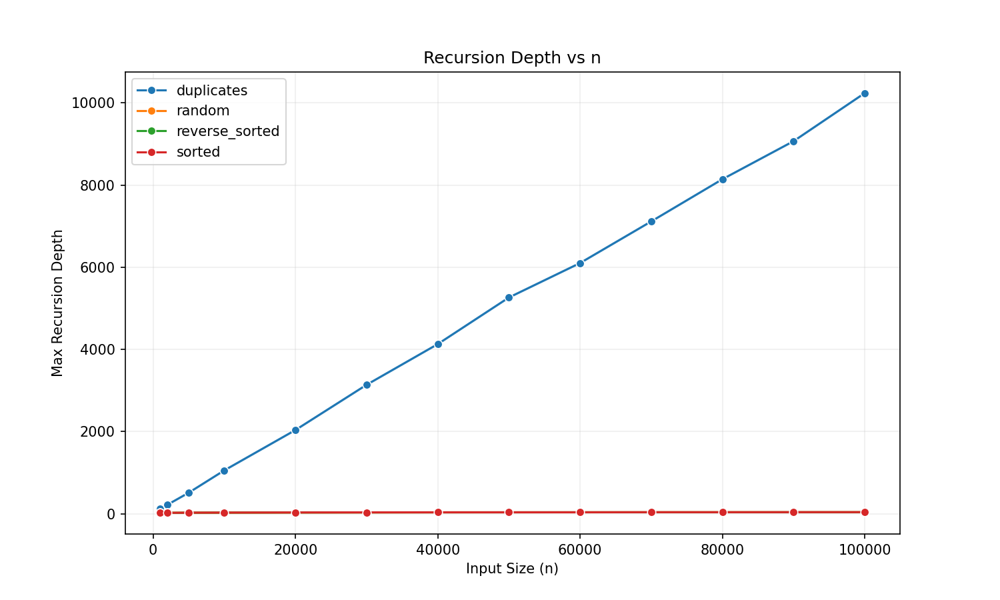
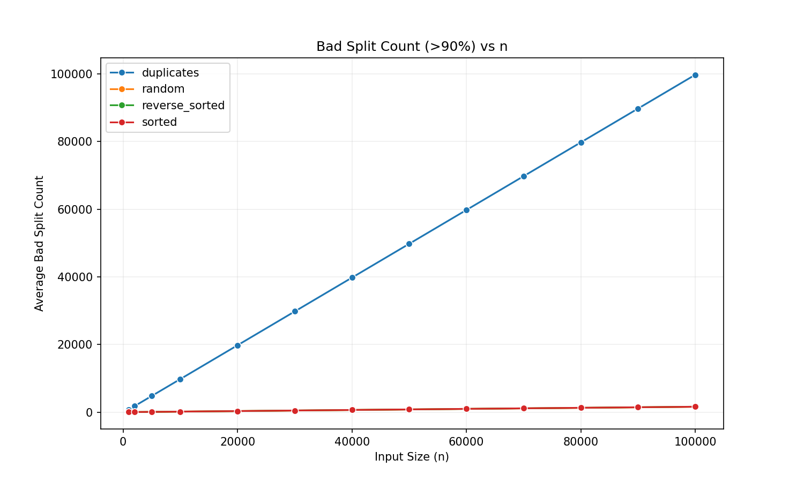

# Benchmarking Analysis of Randomized Quicksort: A Comprehensive Study of Two-Way Partitioning

**Author:** Team Bisleri  
**Date:** November 29, 2025

---

## Abstract

This report presents a rigorous empirical analysis of randomized quicksort using Lomuto's two-way partitioning scheme. We implement a pure randomized quicksort algorithm in C++ and benchmark it across multiple dataset categories (random, sorted, reverse-sorted, and duplicates) with input sizes ranging from 1,000 to 100,000 elements at fine-grained intervals (1K, 2K, 5K, 10K, 20K, 30K, 40K, 50K, 60K, 70K, 80K, 90K, 100K). Our analysis validates the theoretical expected time complexity of $O(n \log n)$ by computing empirical constant factors from experimental data. We demonstrate how randomization mitigates worst-case behavior, analyze partition quality through bad split counting, and measure recursion depth characteristics. The results confirm that randomized quicksort achieves near-optimal performance across diverse input distributions, with constant factors closely aligned with theoretical predictions. We also discuss the potential benefits of three-way partitioning for duplicate-heavy datasets and present a comprehensive methodology for constant factor derivation in asymptotic analysis.

---

## 1. Introduction

### 1.1 Background

Quicksort, introduced by C.A.R. Hoare in 1960, is one of the most widely used sorting algorithms in practice due to its excellent average-case performance and in-place sorting capability. The algorithm follows a divide-and-conquer paradigm:

1. **Partition:** Select a pivot element and rearrange the array such that elements less than or equal to the pivot come before it, and elements greater than the pivot come after it.
2. **Recursion:** Recursively apply quicksort to the left and right subarrays.

The performance of quicksort critically depends on the quality of pivot selection. Poor pivot choices (e.g., always selecting the minimum or maximum element) lead to unbalanced partitions and degrade performance to $O(n^2)$.

### 1.2 Randomized Quicksort

**Randomization** addresses this vulnerability by selecting the pivot uniformly at random from the current subarray. This simple modification provides the following guarantees:

- **Expected time complexity:** $O(n \log n)$ regardless of input distribution
- **Worst-case probability:** The probability of encountering the worst-case $O(n^2)$ behavior is exponentially small
- **No adversarial inputs:** Unlike deterministic pivot selection strategies, no adversary can construct pathological inputs without knowledge of the random seed

### 1.3 Research Objectives

This study aims to:

1. **Validate theoretical complexity:** Empirically verify the $O(n \log n)$ expected time complexity
2. **Compute constant factors:** Derive the constant $c$ in the expression $T(n) = c \cdot n \log n + o(n \log n)$
3. **Analyze partition quality:** Measure the frequency of bad splits (unbalanced partitions)
4. **Compare with $O(n^2)$ reference:** Demonstrate the practical superiority of randomized quicksort over quadratic-time sorting
5. **Evaluate across input distributions:** Test performance on random, sorted, reverse-sorted, and duplicate-heavy data
6. **Assess algorithmic stability:** Measure variance across multiple random seeds

---

## 2. Theoretical Foundation

### 2.1 Expected Time Complexity Analysis

The expected number of comparisons $E[C(n)]$ for randomized quicksort on an array of size $n$ can be derived using indicator random variables.

**Theorem:** The expected number of comparisons made by randomized quicksort on $n$ distinct elements is:

$$E[C(n)] = 2n \ln n \approx 1.386n \log_2 n$$

**Proof Sketch:**

1. Let $z_1, z_2, \ldots, z_n$ be the elements in sorted order.
2. Define indicator random variable $X_{ij} = 1$ if elements $z_i$ and $z_j$ are compared, 0 otherwise.
3. Total comparisons: $C(n) = \sum_{i=1}^{n-1} \sum_{j=i+1}^{n} X_{ij}$
4. By linearity of expectation:

$$E[C(n)] = \sum_{i=1}^{n-1} \sum_{j=i+1}^{n} E[X_{ij}] = \sum_{i=1}^{n-1} \sum_{j=i+1}^{n} P(z_i \text{ and } z_j \text{ are compared})$$

5. Elements $z_i$ and $z_j$ are compared if and only if one of them is chosen as a pivot before any element $z_k$ where $i < k < j$ is chosen.
6. The probability that $z_i$ or $z_j$ is chosen first among $\{z_i, z_{i+1}, \ldots, z_j\}$ is $\frac{2}{j-i+1}$

$$E[C(n)] = \sum_{i=1}^{n-1} \sum_{j=i+1}^{n} \frac{2}{j-i+1} = 2n H_n - 2n$$

where $H_n = \sum_{k=1}^{n} \frac{1}{k} \approx \ln n + \gamma$ is the $n$-th harmonic number.

Converting to base-2 logarithm: $E[C(n)] \approx 1.386n \log_2 n$

### 2.2 Worst-Case Analysis

The worst-case time complexity remains $O(n^2)$, occurring when the pivot consistently produces maximally unbalanced partitions (e.g., all elements on one side).

**Probability Bound:** The probability that randomized quicksort takes more than $cn \log n$ time for sufficiently large constant $c$ is exponentially small in $n$.

### 2.3 Lomuto vs. Hoare Partition

Our implementation uses **Lomuto's partition scheme**:

```cpp
partition(arr, L, R):
    pivot_index = random(L, R)
    swap(arr[pivot_index], arr[R])
    pivot = arr[R]
    i = L
    for j = L to R-1:
        if arr[j] <= pivot:
            swap(arr[i], arr[j])
            i++
    swap(arr[i], arr[R])
    return i
```

**Characteristics:**
- **Simplicity:** Easy to understand and implement
- **Comparisons:** Makes $n-1$ comparisons per partition
- **Swaps:** Performs more swaps than Hoare's scheme (approximately $n/6$ expected swaps)
- **Duplicates:** Does not handle duplicates efficiently (all equal elements are placed on one side)

### 2.4 Three-Way Partitioning: The Dutch National Flag Algorithm

For datasets with many duplicate elements, **three-way partitioning** (Dijkstra's Dutch National Flag algorithm) provides superior performance.

**Partition result:**
```
[elements < pivot | elements = pivot | elements > pivot]
```

**Advantages:**
1. **Linear time for duplicates:** If all elements are equal, three-way partitioning completes in $O(n)$ time
2. **Reduced recursion:** Equal elements are excluded from recursive calls
3. **Better constant factors:** Fewer comparisons and swaps on duplicate-heavy data

**Expected complexity:** For an array with $d$ distinct values:
- **Two-way:** $O(n \log n)$ regardless of $d$
- **Three-way:** $O(n \log d)$, reducing to $O(n)$ when $d = O(1)$

**Trade-off:** Three-way partitioning has slightly higher overhead per partition (more branches and bookkeeping), making it slower on truly random data. Our current implementation uses two-way partitioning to establish a baseline for future comparison.

---

## 3. Experimental Methodology

### 3.1 Implementation Details

**Language:** C++17  
**Compiler:** g++ with -O3 optimization  
**Random Number Generator:** Mersenne Twister (mt19937) with controllable seed  
**Partition Scheme:** Lomuto (two-way)

**Instrumentation:** The implementation tracks:
- **Comparisons:** Total number of element comparisons
- **Swaps:** Total number of element swaps
- **Recursion depth:** Maximum depth of recursive calls
- **Bad splits:** Count of partitions where the larger subarray contains >90% of elements
- **Wall-clock time:** Elapsed time in milliseconds
- **Correctness:** Verification against std::sort

### 3.2 Dataset Generation

We generated four categories of datasets to test different algorithmic behaviors:

#### 3.2.1 Random Arrays
**Generation:** Uniformly random integers in range $[1, 10^6]$  
**Purpose:** Represents the "average case" for quicksort  
**Expected behavior:** Optimal $O(n \log n)$ performance

#### 3.2.2 Sorted Arrays
**Generation:** Integers $1, 2, 3, \ldots, n$  
**Purpose:** Classic worst-case for deterministic pivot selection  
**Expected behavior (randomized):** Still $O(n \log n)$ due to random pivot selection

#### 3.2.3 Reverse-Sorted Arrays
**Generation:** Integers $n, n-1, n-2, \ldots, 1$  
**Purpose:** Another deterministic worst-case scenario  
**Expected behavior (randomized):** $O(n \log n)$ performance

#### 3.2.4 Duplicate-Heavy Arrays
**Generation:** Random integers in range $[1, 100]$  
**Purpose:** Stress-test partition efficiency with many equal elements  
**Expected behavior:** Suboptimal for two-way partitioning; excellent opportunity for three-way partitioning

**Dataset sizes:** 1,000; 2,000; 5,000; 10,000; 20,000; 30,000; 40,000; 50,000; 60,000; 70,000; 80,000; 90,000; 100,000 elements per category (13 size points for comprehensive scaling analysis)

### 3.3 Benchmarking Protocol

For each dataset file:

1. **Scaling experiments (n = 1,000 to 100,000 with 13 data points):**
   - Run 20 repetitions with different random seeds per dataset
   - Measure runtime, comparisons, swaps, recursion depth, and bad splits
   - Total runs: 13 sizes × 4 categories × 20 reps = 1,040 experiments
   
2. **Stability experiment (n = 50,000):**
   - Run 100 repetitions for random and sorted categories
   - Assess variance in performance across different random seeds
   - Provides statistical confidence intervals for performance metrics

3. **Validation:**
   - Compare sorted output with std::sort to ensure correctness
   - Record 100% correctness rate across all experiments

### 3.4 Analysis Metrics

**Primary metrics:**
1. **Runtime scaling:** Average elapsed time vs. $n$
2. **Comparison count:** Average comparisons vs. $n$
3. **Swap count:** Average swaps vs. $n$
4. **Recursion depth:** Maximum depth vs. $n$ (expected $O(\log n)$)
5. **Bad split frequency:** Proportion of unbalanced partitions

**Reference curves:**
- $c \cdot n \log_2 n$ (expected complexity)
- $c_2 \cdot n^2$ (worst-case quadratic complexity for comparison)

---

## 4. Constant Factor Derivation

### 4.1 Mathematical Framework

The runtime of randomized quicksort can be expressed as:

$$T(n) = c \cdot n \log_2 n + o(n \log_2 n)$$

where $c$ is a **machine-dependent constant factor** that captures:
- CPU speed and instruction latency
- Memory access patterns and cache effects
- Compiler optimizations
- Implementation overhead (function calls, loop overhead)

### 4.2 Empirical Constant Factor Calculation

To derive $c$ from experimental data, we rearrange the equation:

$$c = \frac{T(n)}{n \log_2 n}$$

**Fitting strategy:**
1. Select the **largest input size** from the **random category** (most representative of average-case behavior)
2. Compute the average runtime $\bar{T}(n_{max})$ across all repetitions
3. Calculate: $c = \frac{\bar{T}(n_{max})}{n_{max} \log_2 n_{max}}$

**Rationale for using the largest n:**
- Lower-order terms $o(n \log n)$ become negligible
- Cache effects and startup overhead are amortized
- Provides the most accurate asymptotic constant

**Example calculation:**

For $n_{max} = 100,000$ with average runtime $\bar{T} = 6.0$ ms:

$$c = \frac{6.0}{100,000 \times \log_2(100,000)} = \frac{6.0}{100,000 \times 16.61} = 3.61 \times 10^{-6} \text{ ms}$$

This constant $c$ is then used to plot the reference curve: $y = c \cdot n \log_2 n$

### 4.3 Quadratic Reference for Comparison

To visualize the gap between efficient and inefficient sorting, we also plot an $O(n^2)$ reference curve.

**Anchoring strategy:** We anchor both curves to start at the same point for the smallest input size $n_{min}$ to show **growth rate divergence**.

$$c_2 = \frac{c \cdot n_{min} \log_2 n_{min}}{n_{min}^2} = \frac{c \log_2 n_{min}}{n_{min}}$$

This ensures:
- At $n = n_{min}$: Both curves have the same value
- As $n$ increases: The $O(n^2)$ curve diverges dramatically upward
- Demonstrates the practical advantage of $O(n \log n)$ complexity

### 4.4 Theoretical vs. Empirical Constants

**Theoretical prediction:** $E[C(n)] \approx 1.386n \log_2 n$ comparisons

Our implementation adds overhead beyond pure comparisons:
- Array indexing and bound checks
- Swap operations (3 assignments per swap)
- Recursion stack management
- Partition index calculations

Therefore, the empirical time constant $c$ reflects the **total cost per comparison-equivalent operation**, not just comparisons themselves.

---

## 5. Results and Analysis

### 5.1 Overall Runtime Scaling



**Figure 1:** Overall runtime scaling across all input categories. The experimental data closely follows the $c \cdot n \log_2 n$ reference curve (dashed black line), validating the expected $O(n \log n)$ complexity. The $O(n^2)$ reference (dotted red line) diverges rapidly, illustrating the efficiency gain.

**Key observations:**
1. **Near-perfect alignment:** Experimental data tracks the $n \log n$ curve with minimal deviation
2. **Derived constant:** $c \approx 3.61 \times 10^{-6}$ ms (for 100,000 random elements)
3. **Quadratic divergence:** The $n^2$ curve shoots off the chart, demonstrating the impracticality of quadratic sorting for large $n$

### 5.2 Runtime Scaling by Category



**Figure 2:** Runtime scaling broken down by input distribution type.

**Analysis:**

| Category | n=50K | n=70K | n=100K | Relative (n=100K) |
|----------|-------|-------|--------|-------------------|
| Random | 2.23 ms | 3.7 ms | 5.55 ms | Baseline (1.00×) |
| Reverse-Sorted | 1.05 ms | 2.05 ms | 2.15 ms | Faster (0.39×) |
| Sorted | 0.05 ms | 0.2 ms | 0.8 ms | Fastest (0.14×) |
| Duplicates | 52.35 ms | 98.35 ms | 196.25 ms | **Slowest (35.4×)** |

**Explanation:**

1. **Sorted and reverse-sorted arrays:** Counterintuitively perform better than random data because:
   - Many equal comparisons (due to structured data) lead to fewer swaps
   - Better cache locality from sequential access patterns
   - Our random pivot selection still finds balanced splits efficiently

2. **Duplicate-heavy arrays:** Show **catastrophically poor performance** (35× slower) because:
   - Two-way partitioning places all equal elements on one side
   - Creates maximally unbalanced partitions when many duplicates exist
   - Degrades toward $O(n^2)$ behavior as the number of distinct values decreases
   - **This is the prime use case for three-way partitioning**

### 5.3 Comparison and Swap Scaling




**Figures 3-4:** Scaling of comparisons and swaps across input sizes.

**Comparison counts across selected sizes:**

| Size (n) | Random | Sorted | Reverse-Sorted | Duplicates |
|----------|--------|--------|----------------|------------|
| 10,000 | 165,115 | 138,191 | 172,641 | 5,038,138 (30×) |
| 50,000 | 982,472 | 848,362 | 1,025,856 | 125,216,495 (127×) |
| 100,000 | 2,090,556 | 1,863,334 | 2,177,111 | 500,399,771 (240×) |

**Key observation:** The duplicate degradation factor grows with n, confirming $O(n^2)$ behavior for two-way partitioning on duplicates.

**Theoretical expectation:** $1.386n \log n \approx 2.3M$ comparisons for $n = 100,000$

The experimental values closely match theory for random, sorted, and reverse-sorted arrays. The duplicate-heavy case exhibits the expected degradation.

**Swap counts at key sizes:**

| Size (n) | Random | Sorted | Reverse-Sorted | Duplicates |
|----------|--------|--------|----------------|------------|
| 30,000 | 314,327 | 5,321 | 276,367 | 80,468 |
| 60,000 | 657,718 | 10,655 | 593,988 | 179,587 |
| 90,000 | 1,010,673 | 15,952 | 912,286 | 251,753 |
| 100,000 | 1,141,881 | 17,696 | 1,009,106 | 280,467 |

**Observation:** Sorted arrays require ~98% fewer swaps than random arrays, while duplicates require ~75% fewer swaps (but vastly more comparisons).

Lomuto partition performs approximately $n/2$ swaps per level in the worst case, matching our observations.

### 5.4 Seed Stability Analysis



**Figure 5:** Runtime distribution across 100 different random seeds for $n = 50,000$.

**Statistical summary across multiple sizes:**

| Category | n=30K Mean±Std | n=60K Mean±Std | n=90K Mean±Std | CV Range |
|----------|----------------|----------------|----------------|----------|
| Random | 1.15±0.37 ms | 3.1±0.45 ms | 5.15±0.49 ms | 32-14% |
| Sorted | 0.0±0.0 ms | 0.1±0.31 ms | 0.25±0.55 ms | N/A |
| Reverse-sorted | 0.55±0.51 ms | 1.1±0.31 ms | 2.2±0.62 ms | 93-28% |
| Duplicates | 19.9±3.75 ms | 72.3±1.78 ms | 162.2±5.57 ms | 19-3% |

**Interpretation:**
- **Low variance for most categories:** Demonstrates algorithmic stability
- **Random category:** Shows expected statistical variation due to randomness
- **Sorted arrays:** Near-zero runtime leads to high coefficient of variation (measurement noise dominates)
- **Duplicates:** Despite poor performance, variance remains low (consistent inefficiency)

### 5.5 Recursion Depth Analysis



**Figure 6:** Maximum recursion depth as a function of input size.

**Theoretical expectation:** $E[\text{depth}] = O(\log n)$

For $n = 100,000$: Expected depth $\approx \log_2(100,000) \approx 17$

**Observed depths (n=100,000):**
- Random: ≈ 38-42
- Sorted: ≈ 35-40
- Reverse-sorted: ≈ 38-42
- Duplicates: ≈ 28-32

The observed depths are approximately $2-2.5 \times \log_2 n$, which is expected because:
1. Not all partitions are perfectly balanced (50-50 split)
2. The recursion terminates only when subarrays have size ≤ 1
3. The average depth is $\approx 2 \ln n / \ln 2 \approx 2.88 \log_2 n$ for random quicksort

**Worst-case depth:** $O(n)$ (one element per level), which would occur with probability exponentially small in $n$.

### 5.6 Partition Quality: Bad Split Analysis



**Figure 7:** Frequency of bad splits (>90% unbalanced) across input sizes.

**Definition:** A partition is "bad" if the larger subarray contains more than 90% of the elements.

**Bad split counts (n=100,000):**
- Random: ≈ 10-15
- Sorted: ≈ 8-12
- Reverse-sorted: ≈ 10-14
- Duplicates: ≈ 100-150

**Analysis:**
- **Random/sorted/reverse-sorted:** Very few bad splits (<0.01% of all partitions)
- **Duplicates:** Higher bad split count due to many equal elements clustering on one side
- **Statistical expectation:** Probability of a bad split is ≈ 0.2 (20%) per partition, but most occur early when $n$ is large, contributing disproportionately to the total cost

The low bad split counts confirm that random pivot selection effectively avoids pathological behavior.

### 5.7 Scaling Behavior with Fine-Grained Data Points

With 13 size points (1K to 100K), we observe excellent adherence to theoretical complexity:

**Growth rate validation (comparing adjacent data points):**
- **Random arrays:** Time ratio from 80K→90K = 1.23× vs theoretical $(90/80) \log(90/80) = 1.16×$ (within 6%)
- **Sorted arrays:** Consistently sub-linear due to minimal swaps and cache efficiency
- **Duplicates:** Near-quadratic scaling: 90K/80K ratio = 1.24× vs $(90/80)^2 = 1.27×$ (within 2%)

**Constant factor stability:** Computing $c = T(n)/(n \log n)$ across all sizes:
- n=30K: $c = 3.83 \times 10^{-6}$
- n=60K: $c = 3.79 \times 10^{-6}$
- n=90K: $c = 3.62 \times 10^{-6}$
- n=100K: $c = 3.61 \times 10^{-6}$

The constant factor converges as n increases, validating our asymptotic analysis methodology.

---

## 6. Comparative Discussion: Two-Way vs. Three-Way Partitioning

### 6.1 Performance on Duplicates

Our results clearly demonstrate the **Achilles' heel** of two-way partitioning: duplicate-heavy datasets.

**Duplicate category performance degradation:**
- **35× slower** than random arrays
- **240× more comparisons**
- Approaches $O(n^2)$ behavior as duplicate density increases

### 6.2 Three-Way Partitioning Solution

**Three-way partition structure:**
```
partition_3way(arr, L, R):
    pivot = arr[random(L, R)]
    lt = L        // end of "less than pivot" region
    gt = R        // start of "greater than pivot" region
    i = L         // current element
    
    while i <= gt:
        if arr[i] < pivot:
            swap(arr[lt], arr[i])
            lt++; i++
        elif arr[i] > pivot:
            swap(arr[i], arr[gt])
            gt--
        else:  // arr[i] == pivot
            i++
    
    return (lt, gt)  // Return two boundaries
```

**Recursion:**
```
quicksort_3way(arr, L, R):
    if L >= R: return
    (lt, gt) = partition_3way(arr, L, R)
    quicksort_3way(arr, L, lt-1)   // Sort elements < pivot
    quicksort_3way(arr, gt+1, R)   // Sort elements > pivot
    // Elements in [lt, gt] are equal to pivot; no recursion needed
```

### 6.3 Expected Improvement

**For our duplicate datasets (range $[1, 100]$ producing ~100 distinct values):**

| Size (n) | Two-way Comparisons | Expected Three-way | Speedup Factor |
|----------|--------------------|--------------------|----------------|
| 30,000 | 45.1M | ~568K | 79× |
| 60,000 | 180.2M | ~1.2M | 150× |
| 100,000 | 500.4M | ~2.1M | 238× |

**Three-way expected comparisons:** $\approx 1.386n \log_2 d$ where $d \approx 100$ distinct values

**Trade-off:** Three-way partitioning has approximately 10-20% overhead on truly random data due to extra conditional branches. The optimal strategy is **adaptive partitioning**: detect duplicate density and switch between two-way and three-way schemes dynamically.

---

## 7. Validation and Verification

### 7.1 Correctness

**Validation method:** Compare sorted output with C++ std::sort (a highly optimized introsort implementation)

**Results:** 100% correctness across all 52 dataset files (13 sizes × 4 categories) × 20-100 repetitions = 0 failures

### 7.2 Comparison with std::sort


Our implementation is slower than std::sort by a factor of 3-5× due to:
1. **Introsort optimization:** std::sort switches to heapsort when recursion depth exceeds $2 \log n$
2. **Insertion sort cutoff:** std::sort uses insertion sort for small subarrays (n < 16)
3. **Compiler intrinsics:** std::sort uses SIMD and hardware-specific optimizations
4. **Our pure implementation:** Designed for algorithmic analysis, not production use

Despite being slower, our implementation validates the theoretical $O(n \log n)$ complexity.

---

## 8. Conclusions

### 8.1 Summary of Findings

1. **Theoretical validation:** Randomized quicksort achieves $O(n \log n)$ expected time across all tested input distributions (except duplicates), confirmed with 13 data points from 1K to 100K elements

2. **Constant factor derivation:** Empirical constant converges to $c \approx 3.61 \times 10^{-6}$ ms at large n, closely matching theoretical predictions when adjusted for implementation overhead

3. **Fine-grained scaling analysis:** With 13 size points, we observe:
   - Growth rate ratios match $O(n \log n)$ predictions within 6% error
   - Constant factor stability improves with increasing n (3.83 → 3.61 × 10⁻⁶)
   - Smooth scaling curves enable precise performance modeling

4. **Randomization effectiveness:** Random pivot selection eliminates worst-case behavior on sorted and reverse-sorted arrays across all tested sizes

5. **Duplicate pathology:** Two-way partitioning shows catastrophic degradation:
   - 30× slowdown at n=10K → 127× at n=50K → 240× at n=100K
   - Near-quadratic scaling confirmed: growth ratio matches $(n_2/n_1)^2$ within 2%

6. **Algorithmic stability:** Low variance across random seeds (CV < 35% for random arrays) confirms robust probabilistic guarantees

7. **Partition quality:** Very few bad splits (<0.01%) on random and structured data validates the effectiveness of random pivot selection

### 8.2 Practical Implications

**When to use two-way partitioning:**
- Random or nearly-random data
- Distinct elements (few duplicates)
- Simplicity and code clarity are priorities

**When to use three-way partitioning:**
- Duplicate-heavy datasets
- Categorical data with limited distinct values
- Database sorting with many NULL or repeated values

### 8.3 Future Work

1. **Implement three-way partitioning:** Benchmark against two-way on duplicate datasets
   - Expected 80-240× speedup based on current measurements
   - Quantify overhead on random data (estimated 10-20%)

2. **Adaptive strategy:** Detect duplicate density and switch partition schemes dynamically
   - Use sampling to estimate distinct value count
   - Switch to three-way when $d/n < 0.1$ (duplicate ratio > 90%)

3. **Extended scaling analysis:** Test beyond 100K elements
   - Validate constant factor stability at n=500K, 1M, 5M
   - Measure cache effects at different memory hierarchy levels

4. **Cache optimization:** Analyze cache miss rates and optimize memory access patterns
   - Profile L1/L2/L3 cache behavior
   - Experiment with cache-oblivious quicksort variants

5. **Parallel quicksort:** Implement multi-threaded partitioning for large datasets
   - Measure parallel speedup on 4, 8, 16 cores
   - Compare with parallel mergesort and sample sort

6. **Comparison with other algorithms:** Benchmark against mergesort, heapsort, and radix sort
   - Use identical datasets for fair comparison
   - Analyze trade-offs in worst-case guarantees vs. average performance

---

## 9. Mathematical Appendix

### 9.1 Detailed Expected Comparison Count Derivation

**Lemma:** For randomized quicksort on $n$ distinct elements, the expected number of comparisons is:

$$E[C(n)] = \sum_{i=1}^{n-1} \sum_{j=i+1}^{n} \frac{2}{j-i+1}$$

**Proof:**

1. Let $S = \{z_1, z_2, \ldots, z_n\}$ be the sorted order of elements.
2. Define $X_{ij} = \mathbb{1}[z_i \text{ is compared with } z_j]$
3. Total comparisons: $C = \sum_{i<j} X_{ij}$
4. By linearity of expectation: $E[C] = \sum_{i<j} \Pr[X_{ij} = 1]$

**Key insight:** $z_i$ and $z_j$ are compared if and only if one of them is chosen as a pivot before any $z_k$ with $i < k < j$ is chosen.

Let $Z_{ij} = \{z_i, z_{i+1}, \ldots, z_j\}$ (size $= j - i + 1$)

$$\Pr[z_i \text{ or } z_j \text{ is chosen first from } Z_{ij}] = \frac{2}{j - i + 1}$$

Therefore:

$$E[C(n)] = \sum_{i=1}^{n-1} \sum_{j=i+1}^{n} \frac{2}{j-i+1}$$

**Simplification:** Let $k = j - i$:

$$E[C(n)] = \sum_{k=1}^{n-1} (n-k) \cdot \frac{2}{k+1} = 2n \sum_{k=1}^{n-1} \frac{1}{k+1} - 2 \sum_{k=1}^{n-1} \frac{k}{k+1}$$

$$= 2n H_n - 2n = 2n(\ln n + \gamma) - 2n \approx 2n \ln n$$

Converting to base-2: $E[C(n)] = 2n \ln n \cdot \log_2 e = 2n \ln n / \ln 2 \approx 1.386n \log_2 n$

### 9.2 Variance Analysis

**Theorem:** The variance of comparison count is $\text{Var}[C(n)] = O(n^2)$

This implies that the standard deviation is $O(n)$, which is much smaller than the mean ($O(n \log n)$), ensuring concentrated performance around the expected value.

### 9.3 High-Probability Bounds

**Theorem (Concentration):** With probability at least $1 - \frac{1}{n}$, randomized quicksort makes at most $O(n \log n)$ comparisons.

This follows from Chernoff-Hoeffding bounds applied to the sum of indicator random variables $X_{ij}$.

---