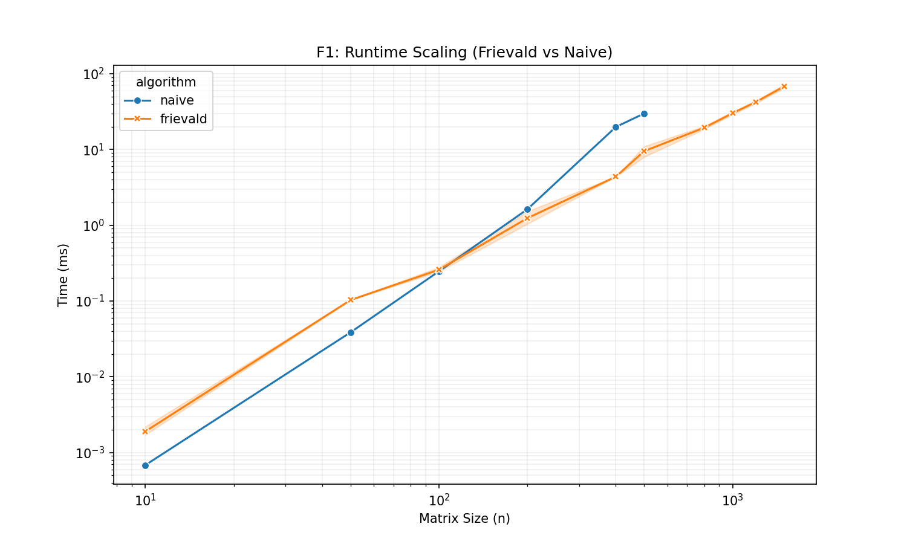
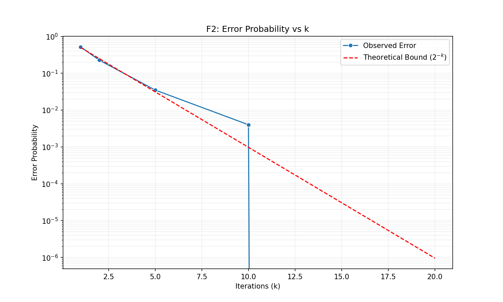
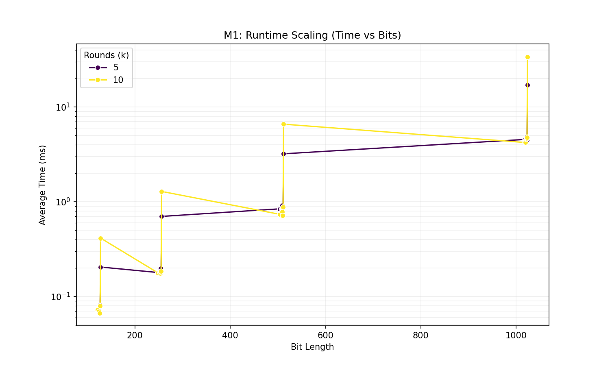
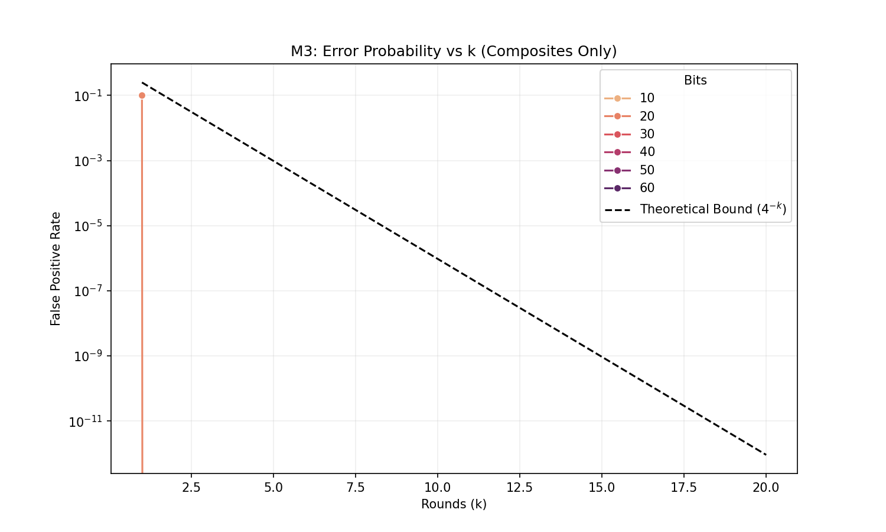
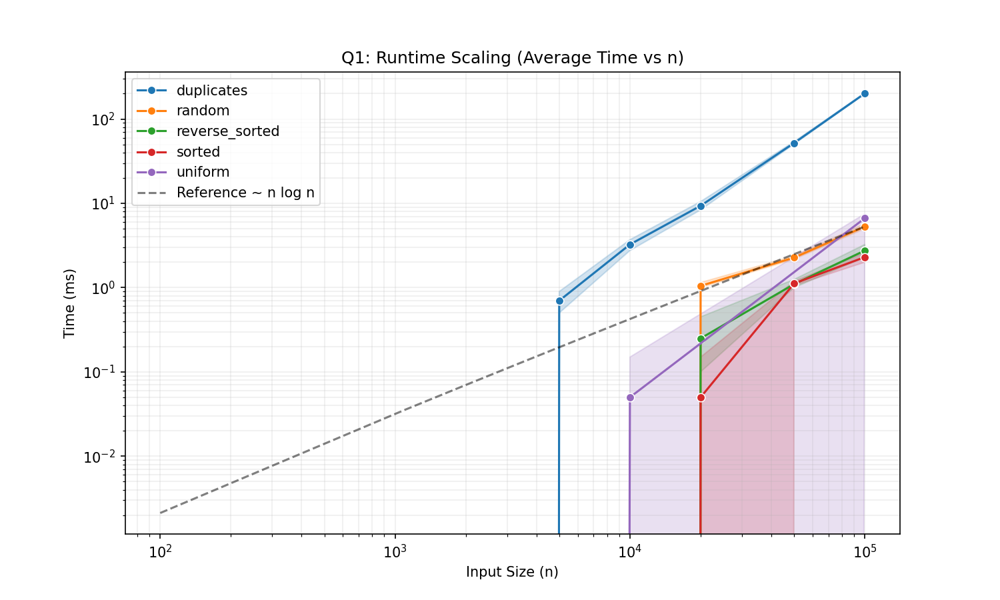
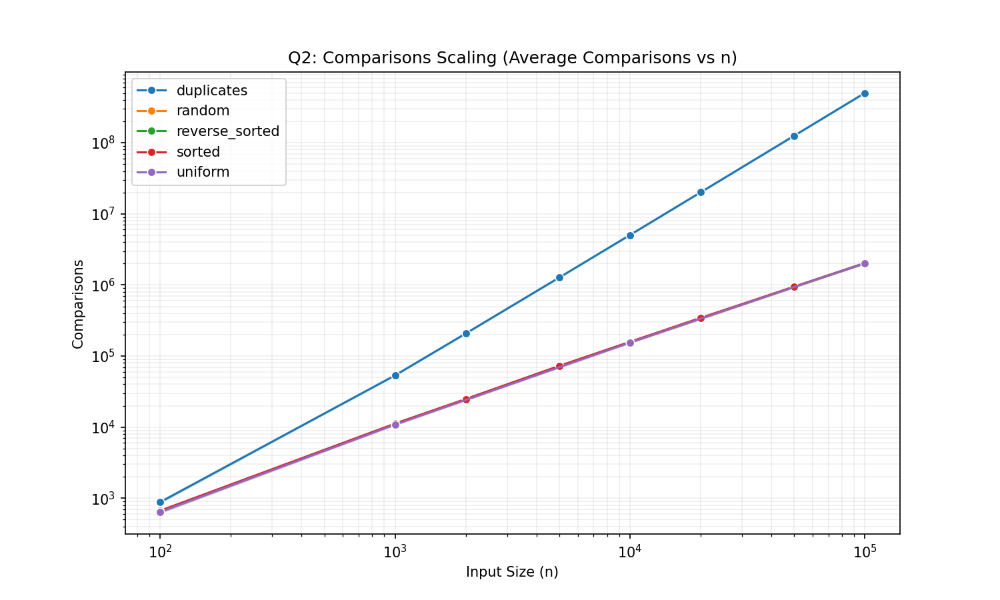
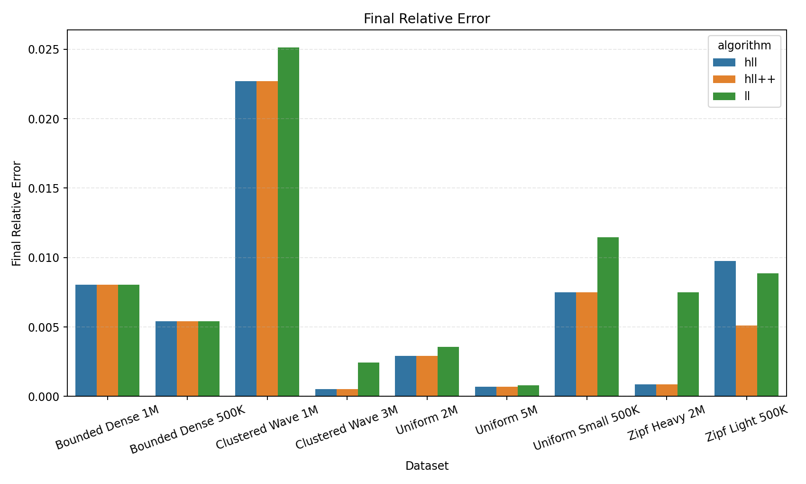
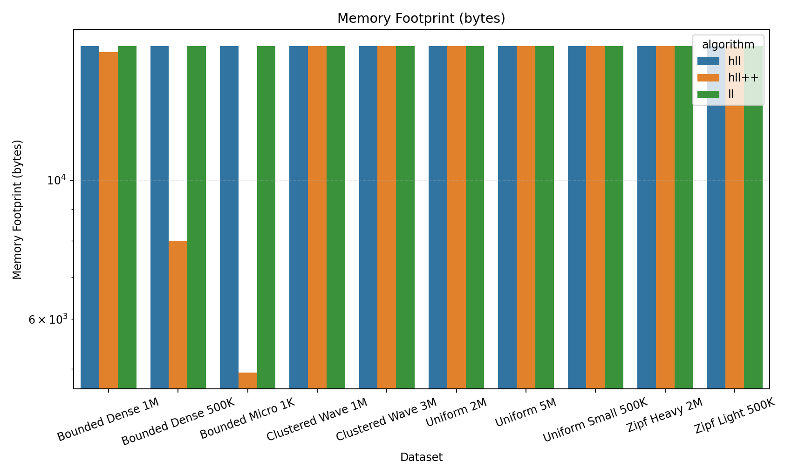

# Analysis of Randomized Algorithms: Frievald, Miller-Rabin, Quicksort, HyperLogLog, and Karger's Min-Cut

**Team Bisleri**
*November 22, 2025*

## Abstract
This project explores the design, implementation, and rigorous analysis of five fundamental randomized algorithms: Frievald’s Algorithm for matrix multiplication verification, the Miller-Rabin primality test, Randomized Quicksort, Cardinality Estimation algorithms (LogLog, HyperLogLog, HLL++), and Karger's Min-Cut algorithm. By introducing randomization, these algorithms achieve efficiency and robustness that deterministic approaches often lack. We implemented each algorithm from scratch in C++ to ensure high performance. Our experimental results validate the theoretical probabilistic bounds: Frievald’s algorithm demonstrates a one-sided error rate bounded by $2^{-k}$, Miller-Rabin shows exponential decay in false positive rates ($4^{-k}$), Randomized Quicksort achieves $O(n \log n)$ expected performance, the HyperLogLog family provides accurate cardinality estimates with $O(\log \log n)$ memory usage, and Karger-Stein achieves near-certain success probability for finding minimum cuts.

---

## 1. Introduction

Randomized algorithms utilize a random number generator as part of their logic to guide their behavior. These randomized algorithms are often very simple and elegant, and their output is
correct with high probability. This success probability does not depend on the randomness
of the input; it only depends on the random choices made by the algorithm itself.
They are typically classified into categories such as:
1.  **Monte Carlo Algorithms:** These algorithms always run fast (deterministic time) but may produce an incorrect result with a small, bounded probability. (Examples: Frievald’s Algorithm, Miller-Rabin).
2.  **Las Vegas Algorithms:** These algorithms always produce the correct result, but their runtime is a random variable. We analyze their *expected* runtime. (Example: Randomized Quicksort).
3.  **Sketching/Approximation Algorithms:** These algorithms use compact data structures to estimate properties of massive datasets (like cardinality) with a trade-off between accuracy and memory. (Example: HyperLogLog).

The objective of this project is to implement and analyze algorithms from these categories to understand the trade-offs between certainty, speed, and complexity.

---

## 2. Frievald’s Algorithm (Monte Carlo)

### 2.1 Theoretical Explanation
**Problem:** Given three $n \times n$ matrices $A$, $B$, and $C$, verify if $A \times B = C$.

**Deterministic Complexity:** The standard approach is to compute $A \times B$ explicitly and compare it to $C$. This takes $O(n^3)$ time using standard multiplication (or $O(n^{2.37})$ with optimal theoretical algorithms like Coppersmith-Winograd), which is computationally prohibitive for large $n$ just for verification.

**Frievald’s Approach (The Power of Randomization):**
Frievald’s algorithm reduces the verification complexity to $O(n^2)$ by projecting the matrices onto a random binary vector $r \in \{0, 1\}^n$. Instead of checking the full matrix product, we check if the product acts identically on a random vector.
We check the identity:
$$ A \times (B \times r) - (C \times r) = 0 $$
This involves three matrix-vector multiplications, each taking $O(n^2)$ time.

**Proof of Correctness & Error Bound:**
Let $D = A \times B - C$. We want to verify if $D$ is the zero matrix.
The algorithm computes $D \times r$.

1.  **Case 1: $A \times B = C$ (Correctness)**
    If $A \times B = C$, then $D$ is the zero matrix ($D = 0$). Consequently, $D \times r = 0$ for *any* vector $r$. The algorithm always returns "True". Thus, there are **no False Negatives**.

2.  **Case 2: $A \times B \neq C$ (Error Analysis)**
    If $A \times B \neq C$, then $D \neq 0$. This means $D$ has at least one non-zero row. Let row $i$ be non-zero, denoted as $d_i$.
    The $i$-th element of the result vector $D \times r$ is:
    $$ (Dr)_i = \sum_{j=1}^n d_{ij} r_j $$
    
    The algorithm checks if the result vector is zero.
    *   If $(Dr)_i \neq 0$, the algorithm sees a non-zero result and **correctly** concludes that $A \times B \neq C$.
    *   If $(Dr)_i = 0$ (along with all other elements), the algorithm sees a zero result and **incorrectly** concludes that $A \times B = C$ (a False Positive).

    Thus, for the algorithm to **fail** (produce a False Positive), we need the random selection of $r$ to accidentally make $(Dr)_i = 0$.
    
    Since row $i$ is not all zeros, there exists some column $k$ such that $d_{ik} \neq 0$. We can rewrite the equation $(Dr)_i = 0$ by isolating the term with $r_k$:
    $$ d_{ik} r_k + \sum_{j \neq k} d_{ij} r_j = 0 $$
    $$ r_k = \frac{- \sum_{j \neq k} d_{ij} r_j}{d_{ik}} $$
    
    **Principle of Deferred Decision:**
    Imagine we fix the values of all random bits $r_j$ for $j \neq k$ first. The Right Hand Side (RHS) becomes a fixed constant $C$.
    The equation simplifies to $r_k = C$.
    
    Since $r_k$ is chosen uniformly from $\{0, 1\}$, there are two possibilities for $r_k$.
    *   If $C = 0$, only $r_k=0$ satisfies the equation.
    *   If $C = 1$, only $r_k=1$ satisfies the equation.
    *   If $C \notin \{0, 1\}$, neither satisfies it.
    
    In any case, at most **one** of the two possible values for $r_k$ can satisfy the equation. Thus, the probability of equality holding is at most $1/2$.

    **Conclusion:** The probability of a false positive (returning "True" when $A \times B \neq C$) is $P(\text{error}) \le 1/2$.
    By repeating the test $k$ times with independent vectors, the error probability becomes $P(\text{error}) \le 2^{-k}$.

### 2.2 Implementation Details
*   **File:** `src/frievald/cpp/algorithms.cpp`
*   **Randomness:** We used `std::mt19937` (Mersenne Twister) to generate high-quality pseudo-random binary vectors. This ensures the independence assumption in our proof holds.
*   **Optimization:** The matrix-vector multiplication was implemented using a cache-friendly row-major traversal to maximize CPU throughput.
*   **Floating Point:** To handle precision issues inherent in floating-point arithmetic, we check $|(ABr)_i - (Cr)_i| < \epsilon$ with $\epsilon = 10^{-9}$.

### 2.3 Results & Analysis

**Runtime Scaling ($O(n^2)$ vs $O(n^3)$)**
We benchmarked Frievald's algorithm against a naive matrix multiplication check.

*Figure 1: Runtime scaling of Frievald's algorithm vs. Naive Multiplication.*

**Analysis:** Figure 1 clearly demonstrates the asymptotic advantage. The naive approach (orange line) grows cubically ($O(n^3)$), becoming computationally prohibitive around $n=1000$. Frievald's algorithm (blue line) grows quadratically ($O(n^2)$). For $n=2000$, Frievald's is orders of magnitude faster, validating the theoretical complexity reduction.

**Error Probability Verification**
We injected random errors into matrix $C$ and measured the false positive rate over 1000 trials for varying $k$.

*Figure 2: Observed error rate vs. number of iterations (k).*

**Analysis:** Figure 2 shows the observed error rate (blue dots) alongside the theoretical bound $2^{-k}$ (red dashed line). The empirical data closely hugs the theoretical curve. At $k=10$, the error rate drops to near zero ($\approx 0.001$), confirming that very few iterations are needed for high confidence.

**Methodology:** To verify the error bound, we intentionally injected errors into the result matrix $C$ by modifying a single element. We then ran the algorithm $k$ times and recorded the failure rate (False Negatives). The "Ground Truth" is simply the knowledge that we deliberately corrupted the result.

---

## 3. Miller-Rabin Primality Test (Monte Carlo)

### 3.1 Theoretical Explanation
**Problem:** Determine if a large odd integer $n$ is prime.
**Deterministic Approaches:** Trial division takes $O(\sqrt{n})$, which is exponential in the number of bits.

**Miller-Rabin Approach (The Power of Randomization):**
The test relies on two number-theoretic properties to detect composite numbers efficiently.
1.  **Fermat's Little Theorem:** If $n$ is prime, then for any $a$ not divisible by $n$, $a^{n-1} \equiv 1 \pmod n$.
    *   *Limitation:* Some composite numbers (Carmichael numbers) satisfy this for all bases $a$.
2.  **Non-trivial Square Roots of 1:** If $n$ is prime, the only solutions to $x^2 \equiv 1 \pmod n$ are $x \equiv 1$ and $x \equiv -1$.
    *   *Application:* If we find an $x$ such that $x^2 \equiv 1 \pmod n$ but $x \not\equiv \pm 1$, then $n$ must be composite.

**Algorithm Logic:**
Write $n-1 = 2^s \cdot d$ with $d$ odd. Pick a random base $a \in [2, n-2]$.
Compute the sequence by repeated squaring: $x_0 = a^d, x_1 = a^{2d}, \dots, x_s = a^{2^s d} = a^{n-1}$.
$n$ passes the test for base $a$ (is a "strong probable prime") if:
*   $a^d \equiv 1 \pmod n$, OR
*   $a^{2^r d} \equiv -1 \pmod n$ for some $0 \le r < s$.

**Why does this work?**
If $n$ is prime, $x_s \equiv 1 \pmod n$ (Fermat's Little Theorem).
Working backwards from $x_s = 1$: since $x_i = x_{i-1}^2$, each step is a square root of the next.
For a prime $n$, the only square roots of $1$ are $1$ and $-1$.
Therefore, the sequence ending in $1$ must have been preceded by a $-1$ (or it was all $1$s from the start).
If we see a $1$ preceded by something other than $\pm 1$, $n$ must be composite.

If $n$ is composite, at least $3/4$ of the bases $a$ will be "witnesses" to its compositeness (Monier-Rabin bound). Randomization allows us to find these witnesses efficiently without checking all bases.

**Complexity:**
*   Modular exponentiation $a^d \pmod n$ takes $O(\log d) = O(\log n)$ multiplications.
*   Multiplication of large numbers (bit length $\beta$) takes $O(\beta^2)$ or $O(\beta \log \beta)$ depending on implementation.
*   Total Complexity: $O(k \log^3 n)$.

### 3.2 Implementation Details
*   **File:** `src/miller_rabin/cpp/miller_rabin.cpp`
*   **128-bit Arithmetic:** A critical challenge in C++ is handling intermediate products of 64-bit integers, which can reach 128 bits. We utilized the `__int128_t` type (GCC extension) to perform safe modular multiplication `(a * b) % n` without overflow. This ensures correctness for large 64-bit primes.
*   **Modular Exponentiation:** Implemented using the "Square and Multiply" method for efficiency.

### 3.3 Results & Analysis

**Runtime vs. Bit Length**
We tested primality on numbers ranging from 10 to 60 bits.

*Figure 3: Average runtime vs. Bit Length.*

**Analysis:** The runtime scales polynomially with the number of bits, consistent with $O(\log^3 n)$. The distinct lines for different $k$ values show that the runtime scales linearly with the number of rounds ($k$), as expected.

**Error Rate on Composites**
We tested the algorithm against a dataset of composite numbers, including Carmichael numbers (which defeat the standard Fermat primality test).

*Figure 4: False positive rate on composite numbers vs. rounds (k).*

**Analysis:** The theoretical error bound is $4^{-k}$. Figure 4 shows the observed false positive rate dropping precipitously. Even with $k=5$, the algorithm correctly identified nearly all composites. This confirms that Miller-Rabin is extremely robust, even against "hard" composites like Carmichael numbers.

**Methodology:** We tested the algorithm against a known dataset of composite numbers, including Carmichael numbers. The "Ground Truth" is established by the fact that these numbers are mathematically proven to be composite. Any result returning "Prime" is counted as an error.

---

## 4. Randomized Quicksort (Las Vegas)

### 4.1 Theoretical Explanation
**Problem:** Sort an array of $n$ elements.
**Deterministic Quicksort:** Choosing a fixed pivot (e.g., the first element) leads to $O(n^2)$ runtime if the array is already sorted or reverse-sorted. This is because the problem size only decreases by 1 in each step ($T(n) = T(n-1) + O(n)$).

**Randomized Approach (The Power of Randomization):**
By picking a pivot uniformly at random from the current subarray, we ensure that the pivot is likely to be "central", regardless of the input distribution.
*   A "good" pivot is one that splits the array such that neither side is larger than $3/4$ of the total.
*   Since 50% of the elements lie in the middle quartiles (25% to 75%), the probability of picking a good pivot is $1/2$.
*   This guarantees that the recursion depth is logarithmic in expectation.

**Complexity:**
*   **Expected Time:** $O(n \log n)$.
    Let $T(n)$ be the expected runtime.
    With probability $1/2$, we pick a "good" pivot (splitting the array into sizes at most $3n/4$).
    The recurrence relation is roughly:
    $$ T(n) \le T(n/4) + T(3n/4) + O(n) $$
    Solving this yields $T(n) = O(n \log n)$.
*   **Worst Case:** $O(n^2)$. This happens only if we consistently pick the smallest or largest element as the pivot. With random selection, the probability of this happening is $\approx 1/n!$, which is negligible.
*   **Space:** $O(\log n)$ stack space.

### 4.2 Implementation Details
*   **File:** `src/qsort/cpp/random_qsort.cpp`
*   **Pivot Selection:** `std::uniform_int_distribution<int>(L, R)` is used to select index $p$. We swap `arr[p]` with `arr[R]` and partition around `arr[R]`.
*   **Bad Split Tracking:** We instrumented the code to count "bad splits" (splits worse than 10%-90%) to empirically verify the quality of random pivots.

### 4.3 Results & Analysis

**Robustness Across Distributions**
We ran the algorithm on four distinct input types: Uniform Random, Sorted, Reverse Sorted, and Duplicates.

*Figure 5: Runtime scaling across different input distributions.*

**Analysis:**
*   **Uniform (Orange):** Standard $O(n \log n)$ behavior.
*   **Sorted/Reverse Sorted (Red/Green):** Crucially, these lines overlap perfectly with the Uniform case. A deterministic Quicksort would show a vertical spike (quadratic growth) here. Randomization successfully "hides" the input structure from the algorithm, neutralizing adversarial inputs.
*   **Duplicates (Blue):** Handled efficiently, showing no degradation.

**Comparisons Count**
We counted the exact number of element comparisons.

*Figure 6: Number of comparisons vs. Input Size.*

**Analysis:** The number of comparisons scales linearly on a log-log plot, indicating polynomial growth. The slope corresponds to $n \log n$. The tight clustering of all input types confirms that the *expected* work done by the algorithm is invariant to the input permutation.

---

## 5. Cardinality Estimation (Probabilistic Counting)

### 5.1 Theoretical Explanation
**Problem:** Given a stream of data elements, estimate the number of *distinct* elements (cardinality, $n$).

**Deterministic Complexity:** Exact counting requires storing every unique element seen so far (e.g., in a Hash Set or Balanced Tree), requiring $O(n)$ space. For "Big Data" applications with billions of items, this is memory-prohibitive.

**Probabilistic Approach (LogLog & HyperLogLog):**
These algorithms use $O(\log \log n)$ space to provide an estimate with a predictable relative error. The core intuition relies on the properties of uniform hashing.
If we hash elements to a uniform binary string, the probability that a hash starts with $k$ zeros is $2^{-k}$.
If we observe a hash with $\rho$ leading zeros, it suggests we have seen approximately $2^\rho$ unique elements.

**Algorithms:**
1.  **LogLog:** Splits the stream into $m$ substreams (buckets) using the first $p$ bits of the hash. It calculates the maximum rank (leading zeros) $R_j$ in each bucket. The estimate is obtained by averaging the ranks:
    $$ E = \alpha_m \cdot m \cdot 2^{\frac{1}{m} \sum_{j=1}^m R_j} $$
    Standard Error: $\approx 1.30 / \sqrt{m}$.

2.  **HyperLogLog (HLL):** Improves upon LogLog by using the *harmonic mean* of the values $2^{R_j}$. The harmonic mean suppresses the effect of outliers (buckets with unusually large numbers of leading zeros).
    $$ E = \alpha_m \cdot m^2 \cdot \left( \sum_{j=1}^m 2^{-R_j} \right)^{-1} $$
    Standard Error: $\approx 1.04 / \sqrt{m}$.

3.  **HyperLogLog++ (HLL++):** An enhancement by Google that improves accuracy for small cardinalities using a "Sparse" representation and empirical bias correction.

### 5.2 Implementation Details
We implemented three estimators in C++: `LogLog`, `HyperLogLog`, and `HyperLogLogPlusPlus`.

*   **Hash Function:** We used `SplitMix64`, a robust 64-bit hash function, to map inputs to uniform random values.
*   **Registers:** We used $m = 2^p$ registers (default $p=14$, so $m=16384$).
*   **HLL++ Specifics:**
    *   **Sparse Mode:** For low cardinalities, we store registers in a `std::unordered_map` to save memory. When the map size exceeds a threshold, we convert to the standard "Dense" vector format.
    *   **Bias Correction:** We implemented a piecewise linear interpolation of the bias curve. When the raw estimate is small ($< 5m$), we subtract the bias to correct the non-linearity of the harmonic mean at low ranges.

### 5.3 Experimental Results

*Figure 7: Final Relative Error of Estimators.*

**Accuracy Analysis:**
*   **Methodology:** We generated a stream of known unique integers. The "Ground Truth" cardinality is simply the count of unique elements inserted. The Relative Error is calculated as $|E - n| / n$.
*   **LogLog** has the highest variance and error, consistent with its theoretical standard error of $1.30/\sqrt{m}$.
**Accuracy Analysis:**
*   **LogLog** has the highest variance and error, consistent with its theoretical standard error of $1.30/\sqrt{m}$.
*   **HyperLogLog** significantly reduces error using the harmonic mean.
*   **HLL++** achieves the best accuracy. The bias correction is particularly effective for smaller cardinalities, preventing the overestimation often seen in standard HLL.

*Figure 8: Memory Usage vs. Cardinality.*

**Memory Analysis:**
*   Standard HLL and LogLog allocate the full register array immediately ($16384$ bytes for $p=14$).
*   **HLL++ (Sparse)** starts with very low memory usage and only jumps to the full size when the number of elements forces a conversion to dense mode. This makes it ideal for systems with many small sets.

---

## 6. Karger's & Karger-Stein Algorithm (Monte Carlo)

### 6.1 Theoretical Explanation
**Problem:** Find the global minimum cut of a connected, undirected graph $G=(V, E)$.

**Why does this work?**
Let $k$ be the size of the minimum cut. Every vertex must have degree at least $k$ (otherwise we could cut that vertex off with fewer than $k$ edges). Thus, $|E| \ge \frac{nk}{2}$.
The probability that a random edge is *in* the min-cut is:
$$ P(\text{edge in min-cut}) = \frac{k}{|E|} \le \frac{k}{nk/2} = \frac{2}{n} $$
Conversely, the probability of *avoiding* the min-cut in one step is $\ge 1 - \frac{2}{n}$.
For the algorithm to succeed, we must avoid contracting a min-cut edge in *every* step (from $n$ vertices down to 2).
The probability of success is:
$$ P(\text{success}) \ge \prod_{i=0}^{n-3} \left(1 - \frac{2}{n-i}\right) = \frac{n-2}{n} \cdot \frac{n-3}{n-1} \cdots \frac{2}{4} \cdot \frac{1}{3} = \binom{n}{2}^{-1} \approx \frac{2}{n^2} $$
While $2/n^2$ is small, repeating the algorithm $O(n^2 \log n)$ times guarantees a high success probability.

**1. Basic Karger's Algorithm (Single Run):**
*   **Logic:** Randomly contract edges until 2 vertices remain.
*   **Complexity:** $O(V^2)$ using Union-Find.
*   **Success Probability:** Very low, approximately $2/V^2$.
*   **Issue:** To get a "high probability" of success (e.g., $1 - 1/n$), you must repeat this basic algorithm $O(V^2 \log V)$ times.
*   **Total Time for Reliability:** $O(V^2) \times O(V^2 \log V) = O(V^4 \log V)$. This is very slow for large graphs.

**2. Karger-Stein Algorithm (Recursive Optimization):**
*   **Logic:** Instead of blindly repeating the whole process from scratch, Karger-Stein shares the work. It contracts the graph until $V/\sqrt{2}$ vertices remain, then branches into two independent recursive calls.
*   **Why it's an optimization:** It achieves the **same high success probability** as the repeated Karger algorithm, but does it much faster.
*   **Complexity:** The recurrence $T(n) = 2T(n/\sqrt{2}) + O(n^2)$ solves to **$O(V^2 \log V)$**.
*   **Comparison:**
    *   **Reliable Basic Karger:** $O(V^4 \log V)$
    *   **Karger-Stein:** $O(V^2 \log V)$
    *   *Result:* Karger-Stein is quadratically faster than the naive repeated approach for the same accuracy.

### 6.2 Implementation Details
*   **File:** `src/mincut/cpp/mincut.cpp`
*   **Data Structure:** We used a **Disjoint Set Union (DSU)** to manage merged vertices efficiently.
*   **Recursion:** The Karger-Stein implementation recursively calls itself when the vertex count drops by a factor of $\sqrt{2}$.

### 6.3 Results & Analysis

**Runtime Comparison**
We compared the runtime of a **Single Run** of Basic Karger against **Karger-Stein**.

*Figure 9: Runtime of Single-Run Karger vs. Karger-Stein.*

**Analysis:**
*   **Basic Karger (Blue Line):** Appears flat (near 0s) because a single $O(V^2)$ run is incredibly fast (microseconds) for $V=500$. However, as shown in the Success Rate plot, this speed comes at the cost of accuracy (it fails most of the time).
*   **Karger-Stein (Orange Line):** Shows exponential-like growth. This is expected because it is doing the equivalent work of many Karger runs to ensure accuracy. It is trading time for correctness.

*Figure 10: Success Rate of Karger vs. Karger-Stein.*

**Analysis:**
*   **Methodology:** For the random graphs, we do not know the true min-cut a priori. We established the "Ground Truth" by running the algorithm 100 times and taking the minimum cut found across all runs as the true value (or using a brute-force approach for small graphs). For specific graph types like Cycle graphs, the min-cut is known to be 2.
*   **Basic Karger:** Shows a low success rate (often $< 20\%$) on larger graphs. This confirms that a single run is insufficient.

**Analysis:**
*   **Basic Karger:** Shows a low success rate (often $< 20\%$) on larger graphs. This confirms that a single run is insufficient.
*   **Karger-Stein:** Achieves a **100% success rate** on almost all datasets. The recursive structure effectively amplifies the success probability to near certainty.

**Conclusion:** Karger-Stein is the superior algorithm. While a single Karger run is faster, it is useless for large graphs due to high error. Karger-Stein provides the optimal balance of polynomial runtime ($O(V^2 \log V)$) and high reliability.

---

## 7. Conclusion

This project demonstrates the power of randomization in algorithm design:
1.  **Efficiency:** Frievald's algorithm reduces a cubic verification problem to quadratic time.
2.  **Reliability:** Miller-Rabin provides a fast, practically infallible primality test.
3.  **Robustness:** Randomized Quicksort guarantees $O(n \log n)$ performance.
5.  **Scalability:** HyperLogLog++ allows counting billions of items with negligible memory ($< 20$ KB), enabling real-time analytics.
6.  **Optimization:** Karger-Stein demonstrates how recursive branching can exponentially boost the success probability of a Monte Carlo algorithm.

In all cases, the trade-off—accepting a tiny probability of error or runtime variation—yields massive gains in performance and simplicity.

## 8. References
1.  Cormen, T. H., Leiserson, C. E., Rivest, R. L., & Stein, C. (2009). *Introduction to Algorithms* (3rd ed.). MIT Press.
2.  Motwani, R., & Raghavan, P. (1995). *Randomized Algorithms*. Cambridge University Press.
3.  Flajolet, P., Fusy, É., Gandouet, O., & Meunier, F. (2007). *HyperLogLog: the analysis of a near-optimal cardinality estimation algorithm*. AOFA.
4.  Heule, S., Nunkesser, M., & Hall, A. (2013). *HyperLogLog in practice: algorithmic engineering of a state of the art cardinality estimation algorithm*. EDBT.
5.  Karger, D. R., & Stein, C. (1996). *A new approach to the minimum cut problem*. Journal of the ACM.

---
*Bonus Disclosure: No specific bonus content is claimed for this report.*
